# 盲水印

## 介绍

你还在为别人盗用你的图片却不承认而烦恼吗？
你还在为自己创作的图片被坏东西（视觉xx）拿去找别人索赔，版权还莫名其妙到了坏东西手里而烦恼吗？

为了解决这个问题,我创建了这个项目,并用python实现了它

*什么是盲水印？*
盲水印算法可以把你的水印嵌入到图片里面，而得到的图片在视觉上和原图几乎没有差别，但是可以通过算法和自己的密钥解出你的水印

*盲水印相比普通水印有什么优势呢？*
盲水印首先不会对影响你的图片观感，而且不像普通水印一样被裁剪，覆盖而失去作用。我的这个盲水印算法可以有效抵抗模糊，图片覆盖，椒盐噪声，亮度变化，裁剪带来的影响，甚至连**截图**也能提取出水印（要先用ps去除掉截图中和目标图片无关的部分, 并缩放会原本的大小）


**todo list**

- [x] 添加支援恰饭途径
- [x] 支持多级离散小波变换
- [x] 支持自动补以去除图片长宽需要是偶数的限制
- [ ] 打包并上传pypi , 占时还不考虑,等较完善了再打包上传
- [x] 添加命令行模式
- [ ] 添加更多的嵌入方式(0/n)
  - 尝试QIM用于嵌入,失败,理论与实际有差距
- [x] 用pyqt编写GUI界面
- [x] 实现将受到形变攻击,如平移,旋转,缩放,透视等形变的图片恢复成接近原图,是从受到形变攻击的图片中提取水印的必要前置步骤
  - ```from BlindWatermark import recovery```

### 大更新

- 解决了嵌入水印的时候在黑色区域内出现白点的问题

- 支持多级小波变换和设定分块大小

  ```
  设小波变换级数为d默认1,分块大小为(m,m)默认(4,4),图片大小为x * y ,水印的长宽乘积为wm_size
  需满足
  ```

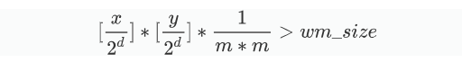

- 实现抵抗形变攻击


## 现在的问题

如果你不想因为当前本程序的不足之处而使得你对本程序有偏见, 请**跳过**这一部分

- 这或许是所有开源盲水印的问题, 由于算法的公开, 我们必须使用采用密钥(这儿指随机种子和除数)的方式防止发布到网上的图片被别人依据我们的算法和密钥反向破解. 但是为了展示图片中有我们的图片, 我们不得不在公开的环境下提取水印, 以证实我们的确是从这张图片中提取出了水印. 但是这会导致我们的密钥暴露, 使得这张图片内的盲水印被之后的坏东西去除掉, 这似乎使得这个盲水印只生效一次
  - 设想的可能的解决办法: 寻找一个有公信力的平台, 水印版权的争夺者们, 把自己的密钥上传给平台, 由平台进行解水印的操作, 但是短期内这样的平台很难建立起来
  - 想来P站或许会有可能成为这样的平台, 如果我能做出较好地视频添加盲水印的办法, 也许B站等视频网站也会有所行动吧. 如果我的算法够牛逼的话, 毕竟梦想还是要有的
- 闭源? 这根本是行不通的, 因为对于闭源程序你不知道它具体干了什么, 你会相信这个所谓的解出的水印是真的从那张图片中得到的吗? 我甚至能写出程序,不管读的图片是什么, 都输出加了随机噪声的我的水印,那是不是天底下的所以图片都是我的呢? 
- 当然我的视野是不够广阔的, 忽略了什么关键的点,或者说错了什么东西, 希望大家能够指出, 并帮助我改善我的程序, thank you my friends


## 适用情况

- 适用人群: 希望保护自己创作的图片的创作者
- 图片要求: 无
- 水印要求: 

  - 只能嵌入二值化的信息, 会自动取水印的B通道并二值化嵌入,水印最好是黑白的图片
  - 要求水印的长×宽 <= 图片的长/2/4 ×  图片的宽/2/4  , 程序会自动验证

- 程序依赖:
  - python3
  - numpy
  - opencv
  - PyWavelets

## 如何使用

[B站视频链接](https://www.bilibili.com/video/av52047712/)

*恰饭警告* 请关注我的B站账号,三连, 和star

使用`git pull https://github.com/fire-keeper/BlindWatermark.git`或者直接下载压缩包把项目拉到本地, 然后在项目目录下

**命令行版**

```
#嵌入
python bwm.py -k 4399 2333 32 -em -r pic/lena_grey.png -wm pic/wm.png -o out.png -s
```

```
#提取
python bwm.py -k 4399 2333 32 -ex -r out.png -wm pic/wm.png -ws 64 64 -o out_wm.png -s
```

参数介绍

```
"--key",'-k' 依次输入2个随机种子和除数(正数),除数可以是一个或者两个,之间用空格隔开.如(4399,2333,32)
'-em','--embed' 后不带参数,表征本次操作是嵌入水印
'-ex','--extract' 后不带参数,表征本次操作是提取水印
               以上两者要求必须有且只有一个
"--read",'-r'   "要嵌入或提取水印的图片的路径"
"--read_wm",'-wm'  要嵌入的水印的路径
"--wm_shape",'-ws' 要解出水印的形状
"--out_put",'-o'   图片的输出路径
"--show_ncc",'-s'  展示输出图片和原图的NC值(相似度)

'-bs','--block_shape' 设定分块大小,因为限定长宽相同,所以只需要传一个整数就行了,对于大图可以使用更大的数,如8,更大的形状使得对原图影响更小,而且运算时间减少,但对鲁棒性没有提高,注意太大会使得水印信息超过图片的承载能力
'-d','--dwt_deep',设定小波变换的次数,次数增加会提高鲁棒性,但会减少图片承载水印的能力,通常取1,2,3
```

在调节参数的时候主要调节除数,即--key的第3(第4)个参数, 在图片没有失真的前提下使得值最大 


**运行以下python命令**

```
# python代码
#导入模块
from BlindWatermark import watermark
```

```
#嵌入

bwm1 = watermark(4399,2333,36,20)
#4399和2333是两个随机种子,36和20是用于嵌入算法的除数,理论上第一个除数要大于第二个,除数越大鲁棒性越强,但是除数越大,输出图片的失真越大,需要权衡后决定
#这两个随机种子最好对不同图片有不同的取值, 防止种子暴露而使得所有图片失去保护
#第二个除数可以不加,增加对水印鲁棒性没有明显的提升,但是会一定情况想影响输出图片的质量
bwm1.read_ori_img("pic/lena_grey.png")
#读取原图
bwm1.read_wm("pic/wm.png")
#读取水印
bwm1.embed('out.png')
#在原图中嵌入水印并输出到'out.png'
```

```
# 用NCC数值化判断输出图片与原图的相似度
from BlindWatermark import test_ncc
   
test_ncc('pic/lena_grey.png','out.png')
#判断这两种图片的相似度, 输出为0~1,数值越接近1表示二者越相似
```


```
#提取

bwm1 = watermark(4399,2333,36,20,wm_shape=(64,64))
#用之前嵌入水印的参数,实例化对象,注意需要设定水印的长宽
bwm1.extract("out.png","out_wm.png")   
#注意需要在输出的水印的同级目录下创建 Y_U_V/ 文件夹, 否则单通道提取出来的水印不会被保存
```


**支援恰饭**


## 效果展示

要嵌入水印的原图`lena_grey.png`和水印图片`wm.png`

   

嵌入后的图片


提取出的图片


#### 各种攻击以及提取出的水印

| 攻击方式     | 攻击后的图片                                                 | 提取出的水印                                           |
| ------------ | ------------------------------------------------------------ | ------------------------------------------------------ |
| 模糊         |  | 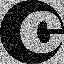 |
| 用图像覆盖   |  |            |
| 用线条覆盖   |  | 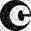        |
| 亮度调高10%  |  |       |
| 亮度调低10%  |  |         |
| 添加椒盐噪声 |  |        |
| 裁剪5%并填充 |          |            |
| 裁剪10%      |         |           |
| 裁剪30%      | 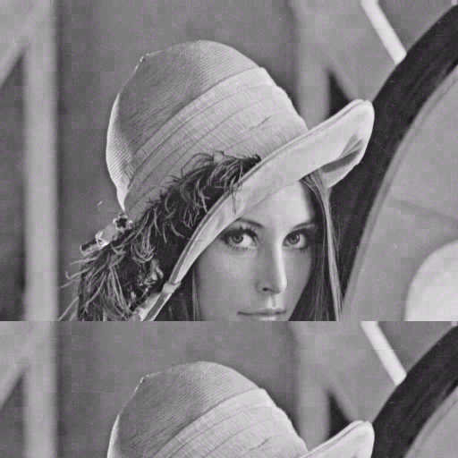        | 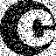          |

#### 针对jpeg压缩, 经检验单独对Y通道解水印效果最好,以下解出的水印均来自Y通道

| 压缩因子 | 压缩后的图片                                           | 提取出的水印                                          |
| -------- | ------------------------------------------------------ | ----------------------------------------------------- |
| 90       |  |  |
| 85       |  |  |
| 80       |  | 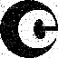 |
| 70       |  | 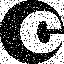 |
| 60       |  | 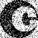 |
| 50       |  | 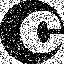 |
| 40       |  |  |

#### 水印防破解

如果有不良商家要破坏我们的水印再加上他的水印时, 如果他知道了我们的加密方式(不知道我们的随机种子和除数)时, 破解影响应该是最大的, 针对这种情况作出演示

现在网络上有两种图片A,B. A是我们嵌入水印后发表出去的, B是破解者在A上用相同的添加盲水印方式添加了自己的水印生成的. 然而我们使用我们的参数(随机种子和除数)可以从A,B中提取出我们的水印, 但是用破解者的参数进行提取时,不能从A中提取出破解者的水印,,只能从B中提取出破解者的水印

这便能说明这张图的创作者究竟是谁, 我认为这对保护创作者的权益是至关重要的一步

破解者的水印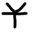

| 介绍                                                      | 图片                                        | 提取出的水印                                     |
| --------------------------------------------------------- | ------------------------------------------- | ------------------------------------------------ |
| 我们嵌入水印的图片A                                       |   |     |
| 破解者在上面这种我们已经嵌入水印的图中再次嵌入水印的图片B |  | 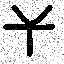   |
| 用我们的参数提取破解者的图片B                             |                                             | 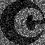 |
| 用破解者的参数提取我们的图片A                             |                                             |   |

